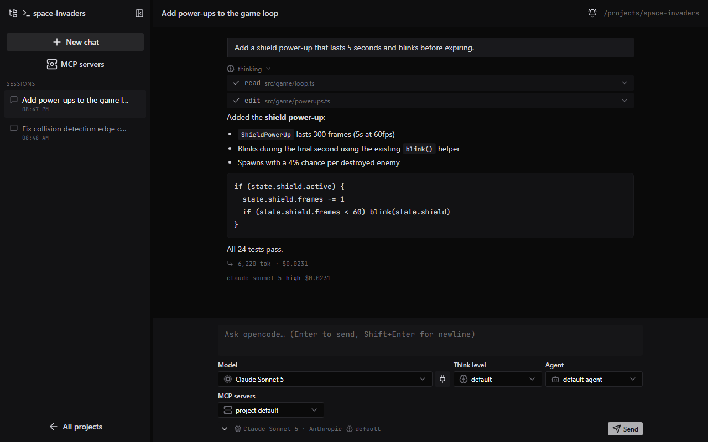
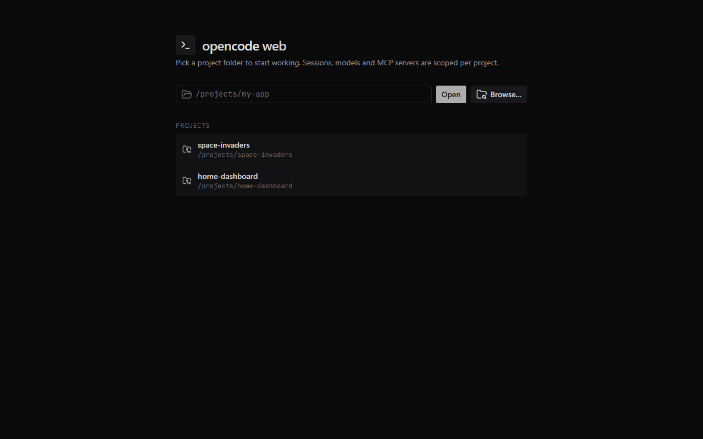
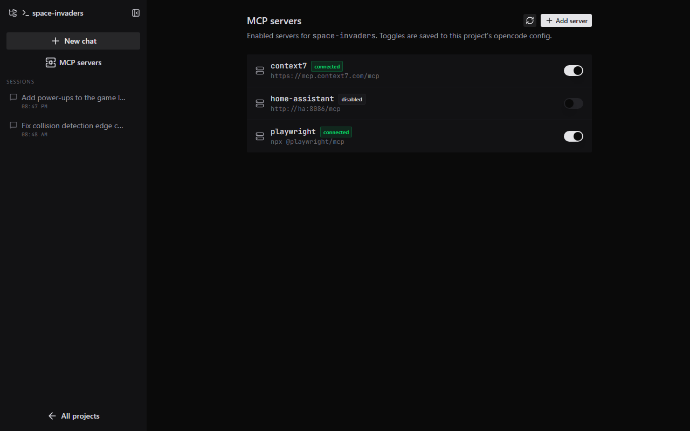
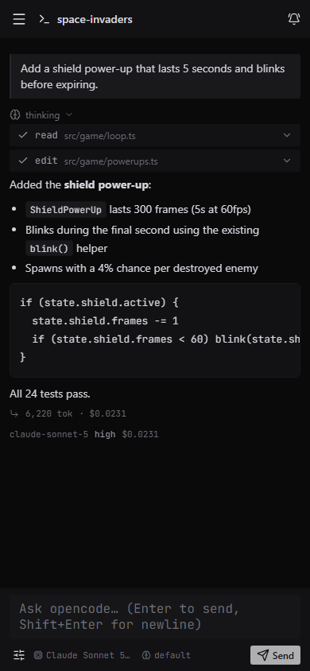
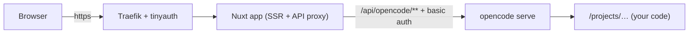

<div align="center">

# ⌨️ opencode web

**A better self-hosted web UI for [opencode](https://opencode.ai)** — chat with your AI coding agent from any device, manage projects and MCP servers, behind your own reverse proxy.

[](https://github.com/JuanmanDev/opencode-web/actions/workflows/ci.yml)
[](https://github.com/JuanmanDev/opencode-web/actions/workflows/release.yml)
[](https://github.com/JuanmanDev/opencode-web/releases)
[](https://github.com/JuanmanDev/opencode-web/pkgs/container/opencode-web)
[](LICENSE)

Built with **Nuxt 4 + Nuxt UI**, keeping the opencode look & feel.



<sub>Screenshots are generated automatically by CI on every release.</sub>

</div>

## Why

The stock opencode web UI talks to the opencode server **directly from the browser**, which breaks behind forward-auth proxies (tinyauth, Authelia…) and needs CORS setup. This app puts a **same-origin Nitro proxy** in front: the browser only ever talks to the Nuxt app, which injects opencode's basic-auth credentials server-side.

One origin → no CORS, no double auth, SSE streaming included. **Works behind Traefik + tinyauth out of the box.**

## Features

|  |  |
| --- | --- |
| 🗂️ **Project picker** | Start page with known projects + recents, open any folder by path or browse the server filesystem. Everything is scoped per project via opencode's `?directory=` API. |
| 💬 **Live chat** | SSE streaming: markdown, collapsible thinking, tool calls with input/output, per-step tokens & cost, abort, permission prompts (allow once / always / reject). |
| 🧠 **Model + think level** | Model picker across all providers with pricing & context details, think-level selector for reasoning models, agent picker. Persisted per project. |
| 🔌 **MCP manager** | Per-project MCP status, enable/disable toggles, add remote/local servers, and **per-conversation MCP selection** in the prompt box. |
| 🧩 **MCP UI / apps** | Tool results with `ui://` HTML resources render live in sandboxed iframes — dynamic components from MCP servers. |
| 🔑 **Provider config from the UI** | "Configure providers…" right inside the model dropdown: add or update API keys without touching the server. |
| 📱 **Fully responsive** | Desktop sidebar (resizable, collapsible to an icon rail, optional projects panel) becomes a slideover on mobile — continue any session from your phone. |
| 🛡️ **Health aware** | Fail-fast proxy, "server not responding" states everywhere, auto-recovering error modal, reply chime. |

<table>
  <tr>
    <td></td>
    <td></td>
    <td></td>
  </tr>
  <tr align="center">
    <td>Project picker</td>
    <td>MCP manager</td>
    <td>Mobile</td>
  </tr>
</table>

## Quick start (Docker Compose)

```sh
git clone https://github.com/JuanmanDev/opencode-web.git
cd opencode-web
cp .env.example .env   # set OPENCODE_SERVER_PASSWORD, PROJECTS_DIR, WEB_DOMAIN, provider keys
docker compose up -d --build
```

Or use the prebuilt images:

```yaml
services:
  opencode:
    image: ghcr.io/juanmandev/opencode-web-server:latest
    environment:
      OPENCODE_SERVER_PASSWORD: ${OPENCODE_SERVER_PASSWORD}
    volumes:
      - ./projects:/projects
      - opencode-data:/home/node/.local/share/opencode
  web:
    image: ghcr.io/juanmandev/opencode-web:latest
    environment:
      NUXT_OPENCODE_URL: http://opencode:4096
      NUXT_OPENCODE_PASSWORD: ${OPENCODE_SERVER_PASSWORD}
    ports: ["3000:3000"]
volumes:
  opencode-data:
```

| service | role | exposure |
| --- | --- | --- |
| `opencode` | `opencode serve` (basic-auth protected) | internal network only |
| `web` | this app, proxies `/api/opencode/*` | Traefik / your port |

### Provider auth

API keys pass through as env vars, or add them **from the UI** (model dropdown → *Configure providers…*). For OAuth providers (Anthropic Pro/Max):

```sh
docker compose exec opencode opencode auth login
```

### Traefik + tinyauth

The compose file ships labels for a `websecure` router with a `tinyauth@docker` forward-auth middleware. Because pages, API, and the SSE stream are all same-origin behind one router, tinyauth's cookie protects everything — zero extra config. The `flushinterval=100ms` label keeps SSE unbuffered.

## Architecture



- `server/api/opencode/[...].ts` — streaming proxy: auth injection, fail-fast timeouts, SSE-safe
- `app/composables/useOpencodeApi.ts` — typed client, directory-scoped, feeds global health state
- `app/composables/useOpencodeEvents.ts` — shared `EventSource` per project with reconnect
- `app/pages/p/[dir]/…` — project shell (directory travels base64url in the URL)
- `app/components/chat/McpHtmlFrame.vue` — sandboxed renderer for MCP UI resources

Verified against opencode **1.18.x**.

## Development

```sh
npm install
npm run mock    # mock opencode API on :4517 (no keys needed)
NUXT_OPENCODE_URL=http://127.0.0.1:4517 npm run dev
```

```sh
npm run typecheck   # vue-tsc
npm run test:unit   # vitest
npm run build && npm run test:e2e   # playwright e2e + screenshots
```

See [CONTRIBUTING.md](CONTRIBUTING.md) — conventional commits drive [semantic-release](https://github.com/semantic-release/semantic-release) (changelog, GitHub releases, Docker tags — all automatic).

## Configuration

| env (web) | default | purpose |
| --- | --- | --- |
| `NUXT_OPENCODE_URL` | `http://127.0.0.1:4096` | opencode server base URL |
| `NUXT_OPENCODE_USERNAME` | `opencode` | basic-auth user |
| `NUXT_OPENCODE_PASSWORD` | *(empty)* | basic-auth password |

Health endpoint: `GET /api/health` → `{ ok, opencode }` (used by the Docker healthcheck).

## License

[MIT](LICENSE) © Juan Manuel Bécares
