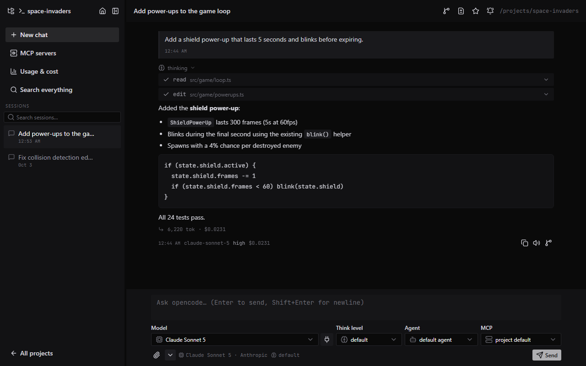
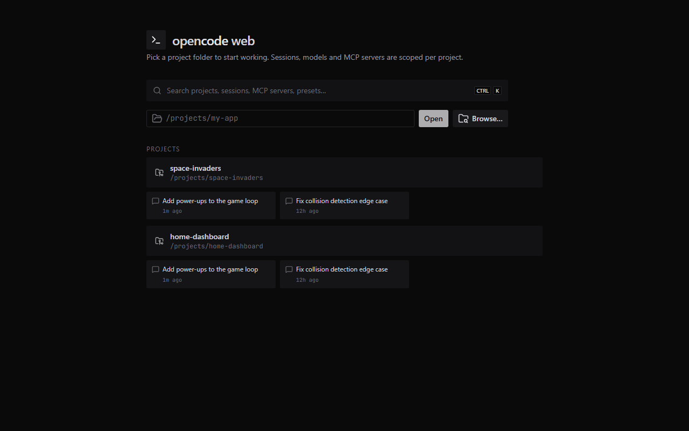
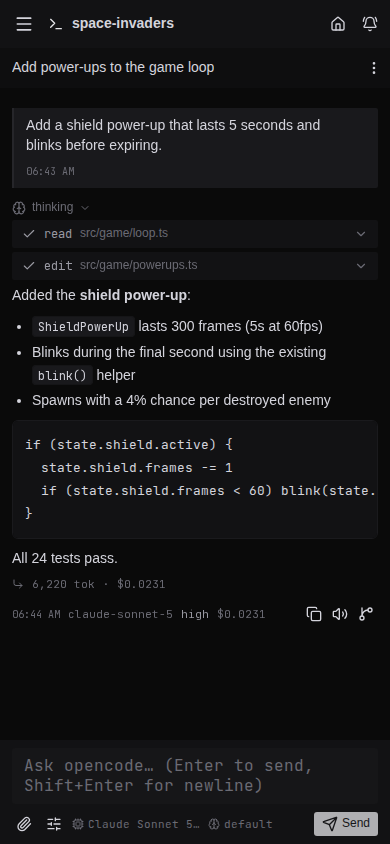
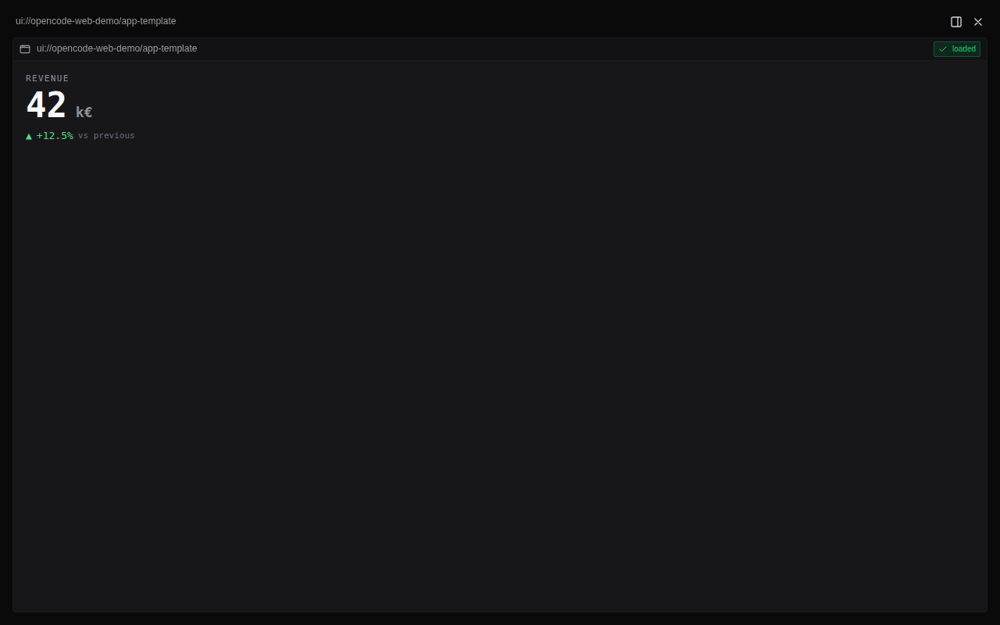
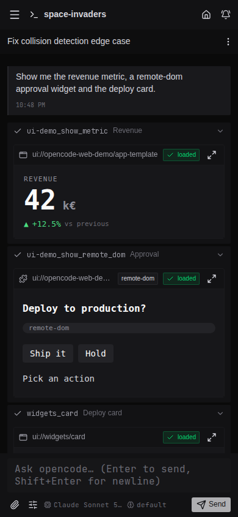
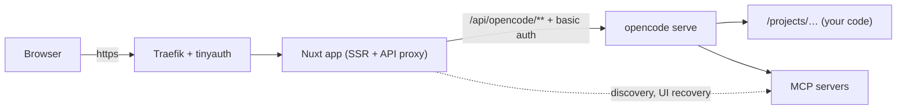

<div align="center">

# ⌨️ opencode web

**A better self-hosted web UI for [opencode](https://opencode.ai)**: chat with your AI coding agent from any device, manage projects and MCP servers, and run MCP UI apps, all behind your own reverse proxy.

[](https://github.com/JuanmanDev/opencode-web/actions/workflows/ci.yml)
[](https://github.com/JuanmanDev/opencode-web/actions/workflows/release.yml)
[](https://github.com/JuanmanDev/opencode-web/releases)
[](https://github.com/JuanmanDev/opencode-web/pkgs/container/opencode-web)
[](LICENSE)
[](https://github.com/sponsors/JuanmanDev)

Built with **Nuxt 4 + Nuxt UI**, keeping the opencode look & feel.



<sub>Screenshots are generated by CI against a mock opencode server and refreshed on every release.</sub>

</div>

## Why

The stock opencode web UI talks to the opencode server **directly from the browser**, which breaks behind forward-auth proxies (tinyauth, Authelia…) and needs CORS setup. This app puts a **same-origin Nitro proxy** in front: the browser only ever talks to the Nuxt app, which injects opencode's basic-auth credentials server-side.

One origin means no CORS, no double auth, and SSE streaming included. **It works behind Traefik + tinyauth out of the box.**

## Features

|  |  |
| --- | --- |
| 🗂️ **Project picker** | Start page with known projects and recents. Open any folder by path or browse the server filesystem. Everything is scoped per project via opencode's `?directory=` API. |
| 💬 **Live chat** | SSE streaming with markdown, collapsible thinking, tool calls with input/output, per-step tokens & cost, timestamps, abort, a prompt queue, and permission and question prompts that survive reloads. Message actions: copy, read aloud, edit & resend, fork. |
| 🧠 **Model + think level** | Model picker across all providers with pricing & context details, think-level selector for reasoning models, agent picker. Persisted per project. |
| 🔌 **MCP manager** | Per-project and global MCP status, off / ask / auto modes per server and per tool, presets, and add remote or local servers from a catalog, a URL, a command line or pasted JSON. **Per-conversation MCP selection** in the prompt box. Tool lists are discovered from the servers themselves over **Streamable HTTP, legacy SSE or stdio**. Broken servers get inline **Retry** and OAuth **Sign in** actions. [More →](docs/mcp.md) |
| 🧩 **MCP UI apps** | Tool results render live in sandboxed iframes: **MCP Apps** (SEP-1865 JSON-RPC host, theme & display-mode aware), mcp-ui **raw HTML**, **external URLs** and **remote-dom** components. Apps can move to a side panel or fullscreen, with shareable `?app=` links. Tools aren't re-run silently: only read-only ones are, and the rest get a **Render UI** button. A built-in demo server (`/mcp-demo`) showcases every flavour. [More →](docs/mcp.md#mcp-ui-apps) |
| 🔑 **Provider config from the UI** | "Configure providers…" right inside the model dropdown adds or updates API keys without touching the server. Keys are never sent back to the browser. |
| 📱 **Mobile first** | The desktop sidebar (resizable, collapsible to an icon rail, optional projects panel) becomes a slideover on phones. There are touch-sized controls, safe-area aware layouts and a prompt box that stays above the keyboard, so you can continue any session from your phone. Installable as a PWA. |
| 🤖 **Scriptable** | REST API with an OpenAPI spec, an MCP server (`/mcp`) to drive opencode from Claude, Cursor or n8n, and WebMCP tools in the page. |
| 🛡️ **Safe by default** | Fail-fast proxy with health states everywhere, CSRF origin checks, optional API token, secret redaction and strict iframe sandboxing. [More →](docs/security.md) |

<table>
  <tr>
    <td></td>
    <td></td>
    <td></td>
  </tr>
  <tr align="center">
    <td>Project picker</td>
    <td>MCP manager</td>
    <td>Mobile</td>
  </tr>
  <tr>
    <td></td>
    <td></td>
    <td></td>
  </tr>
  <tr align="center">
    <td>MCP apps inline</td>
    <td>Fullscreen app viewer</td>
    <td>Apps on a phone</td>
  </tr>
</table>

## Quick start (Docker Compose)

```sh
git clone https://github.com/JuanmanDev/opencode-web.git
cd opencode-web
cp .env.example .env   # set OPENCODE_SERVER_PASSWORD, PROJECTS_DIR, WEB_DOMAIN, provider keys
docker compose up -d --build
```

Or use the prebuilt multi-arch images (`ghcr.io/juanmandev/opencode-web` and `ghcr.io/juanmandev/opencode-web-server`). See **[docs/deployment.md](docs/deployment.md)** for a LAN-only compose file, the volumes to keep, upgrade notes and troubleshooting.

| service | role | exposure |
| --- | --- | --- |
| `opencode` | `opencode serve` (basic-auth protected) with node/npx, python/uvx for MCP servers | internal network only |
| `web` | this app: UI, `/api/opencode/*` proxy, REST API, MCP server | Traefik / your port |

### Provider auth

API keys pass through as env vars, or you can add them **from the UI** (model dropdown → *Configure providers…*). For OAuth providers (Anthropic Pro/Max):

```sh
docker compose exec opencode opencode auth login
```

### MCP servers

Add servers from the MCP page, or in opencode's config (the `opencode-config` volume):

```jsonc
{
  "mcp": {
    "context7": { "type": "remote", "url": "https://mcp.context7.com/mcp" },
    "legacy":   { "type": "remote", "url": "http://10.0.0.5:8095/sse" },
    "n8n": {
      "type": "local",
      "command": ["npx", "-y", "@leonardsellem/n8n-mcp-server"],
      "environment": { "N8N_API_URL": "https://n8n.example.com/api/v1", "N8N_API_KEY": "…" }
    }
  }
}
```

Details, the demo server and how UI apps are recovered: **[docs/mcp.md](docs/mcp.md)**.

### Traefik + tinyauth

The compose file ships labels for a `websecure` router with a `tinyauth@docker` forward-auth middleware. Pages, API and the SSE stream are all same-origin behind one router, so tinyauth's cookie protects everything with no extra config. The `flushinterval=100ms` label keeps SSE unbuffered. To expose the API or MCP endpoint to scripts, see [docs/security.md](docs/security.md#api-token-and-the-ui-cookie).

## Architecture


```mermaid
flowchart LR
    B[Browser] -->|https| T[Traefik + tinyauth]
    T --> W["Nuxt app (SSR + API proxy)"]
    W -->|"/api/opencode/** + basic auth"| O[opencode serve]
    O --> P["/projects/… (your code)"]
    O --> M[MCP servers]
    W -.->|discovery, UI recovery| M
```

- `server/api/opencode/[...].ts`: streaming proxy with auth injection, fail-fast timeouts, SSE-safe, upstream released on disconnect, secrets redacted
- `server/middleware/security.ts`: CSRF origin check and the UI cookie for token mode
- `server/utils/mcp-client.ts`: MCP client (Streamable HTTP and legacy SSE) for discovery and UI recovery
- `server/utils/mcp-stdio.ts`: stdio discovery for local servers
- `app/composables/useOpencodeApi.ts`: typed client, directory-scoped, feeds global health state
- `app/composables/useOpencodeEvents.ts`: shared `EventSource` per project with reconnect
- `app/pages/p/[dir]/…`: project shell (the directory travels base64url-encoded in the URL)
- `app/components/chat/McpHtmlFrame.vue`: sandboxed renderer and MCP Apps host for MCP UI resources

Verified against opencode **1.18.x**.

## API & MCP

The app is scriptable three ways: automate opencode from n8n, scripts, or any AI agent.

**REST API** (`/api/v1/*`, spec at [`/api/v1/openapi.json`](http://localhost:3000/api/v1/openapi.json)):

```sh
# send a prompt and wait for the reply
curl -X POST https://opencode.example.com/api/v1/sessions/$SESSION/prompt \
  -H 'content-type: application/json' \
  -d '{"directory": "/projects/my-app", "text": "Fix the failing tests", "model": "anthropic/claude-sonnet-5", "variant": "high"}'
```

`model` takes `"provider/model"` or `{ "providerID", "modelID" }`. Omit it to use opencode's configured default.

Endpoints: projects, sessions (list/create/delete), messages, prompt (waits for the full reply), abort, models, agents, MCP status and tools.

**MCP server** (Streamable HTTP at `POST /mcp`) plugs opencode-web into Claude, Cursor, or any MCP client:

```json
{ "mcpServers": { "opencode": { "url": "https://opencode.example.com/mcp" } } }
```

Tools: `list_projects`, `create_project`, `list_sessions`, `create_session`, `send_prompt` (waits for the reply and auto-creates sessions), `get_messages`, `abort_session`, `fork_session`, `list_models`, `mcp_status`, `list_mcp`, `set_mcp_mode`, `set_tool_mode`.

**WebMCP:** on browsers with `navigator.modelContext`, the page registers its own tools (`opencode_send_prompt`, `opencode_open_project`, …) so in-browser agents can drive the UI directly.

**Auth:** set `NUXT_API_TOKEN` and clients must send `Authorization: Bearer <token>`. The UI keeps working through an HttpOnly page cookie. Unset, these routes rely on your reverse-proxy auth. See [docs/security.md](docs/security.md).

## Configuration

| env (web) | default | purpose |
| --- | --- | --- |
| `NUXT_OPENCODE_URL` | `http://127.0.0.1:4096` | opencode server base URL |
| `NUXT_OPENCODE_USERNAME` | `opencode` | basic-auth user |
| `NUXT_OPENCODE_PASSWORD` | *(empty)* | basic-auth password |
| `NUXT_API_TOKEN` | *(empty)* | bearer token for `/api/v1/*`, `/mcp` and the proxy when set |
| `NUXT_ALLOWED_ORIGINS` | *(empty)* | extra browser origins allowed to send POSTs (comma separated), e.g. an MCP inspector |
| `NUXT_PUBLIC_DEMO_MCP_URL` | *(browser origin)* | URL at which opencode reaches the built-in `/mcp-demo` server (`http://web:3000/mcp-demo` in compose) |
| `NUXT_MCP_LOCAL_DISCOVERY` | `always` | `always` / `same-host` / `never`: whether the web app spawns local MCP servers to list their tools |

Health endpoint: `GET /api/health` → `{ ok, opencode }` (used by the Docker healthcheck).

## Development

```sh
npm install
npm run mock    # mock opencode API on :4517 (no keys needed)
NUXT_OPENCODE_URL=http://127.0.0.1:4517 npm run dev
```

```sh
npm run typecheck   # vue-tsc
npm run test:unit   # vitest: MCP client (HTTP + SSE), redaction, directory encoding
npm run build && npm run test:e2e   # playwright e2e against the mock, incl. MCP UI apps and mobile
SCREENSHOTS=1 npm run test:e2e      # also regenerate docs/screenshots
```

See [CONTRIBUTING.md](CONTRIBUTING.md). Conventional commits drive [semantic-release](https://github.com/semantic-release/semantic-release).

### CI/CD

| workflow | runs on | does |
| --- | --- | --- |
| **CI** | every PR and push to `main` | actionlint, typecheck, unit tests, Playwright e2e (+ screenshots), Docker build of both images with a smoke test (health, SSR, demo MCP, non-root, healthcheck), conventional-commit lint on PRs |
| **Release** | after CI passes on `main` | semantic-release (version, changelog, GitHub release). It then builds both images natively on amd64 and arm64 runners, from the release tag, with SBOM and provenance, and publishes multi-arch manifests (`latest`, `X.Y.Z`, `X.Y`). It also runs a Trivy scan into the Security tab and commits the screenshots CI captured |
| **Dependabot** | weekly | npm, GitHub Actions and Docker base images |

Nothing is released unless the exact commit passed CI.

## 💖 Support this project

opencode web is free and MIT-licensed. If it saves you time, consider sponsoring. It keeps the releases, Docker images and opencode compatibility work going.

[](https://github.com/sponsors/JuanmanDev) [](https://ko-fi.com/juanmandev) [](https://paypal.me/juanmandev)

Bug reports and PRs are welcome too: see [CONTRIBUTING.md](CONTRIBUTING.md). Security issues go through a [private advisory](https://github.com/JuanmanDev/opencode-web/security/advisories/new).

## License

[MIT](LICENSE) © Juan Manuel Bécares
