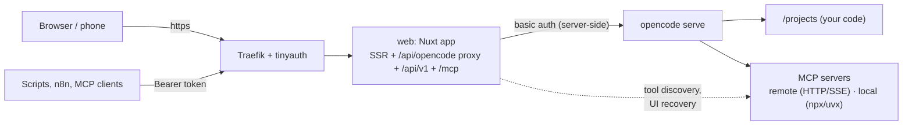

# Deployment

Two containers: `opencode` (the agent server, internal only) and `web` (this app, the only thing you expose).



## Images

| image | contents | tags |
| --- | --- | --- |
| `ghcr.io/juanmandev/opencode-web` | the web app, non-root, healthcheck on `/api/health` | `latest`, `X.Y.Z`, `X.Y` |
| `ghcr.io/juanmandev/opencode-web-server` | `opencode serve` + git, ripgrep, node/npx, python3, uv/uvx; non-root, healthcheck | `latest`, `X.Y.Z`, `X.Y`, `opencode-<version>` |

Both are multi-arch (`linux/amd64`, `linux/arm64`) and ship SBOM and provenance attestations.

## With Traefik + tinyauth

The repository's [`docker-compose.yml`](../docker-compose.yml) is ready for it: copy `.env.example` to `.env`, set `OPENCODE_SERVER_PASSWORD`, `PROJECTS_DIR`, `WEB_DOMAIN` and your provider keys, then:

```sh
docker compose up -d --build
```

## LAN only, prebuilt images

```yaml
services:
  opencode:
    image: ghcr.io/juanmandev/opencode-web-server:latest
    restart: unless-stopped
    environment:
      OPENCODE_SERVER_PASSWORD: ${OPENCODE_SERVER_PASSWORD:?set in .env}
    volumes:
      - ./projects:/projects
      - opencode-data:/home/node/.local/share/opencode
      - opencode-state:/home/node/.local/state/opencode
      - opencode-config:/home/node/.config/opencode
      - opencode-cache:/home/node/.cache
      - opencode-npm:/home/node/.npm
  web:
    image: ghcr.io/juanmandev/opencode-web:latest
    restart: unless-stopped
    environment:
      NUXT_OPENCODE_URL: http://opencode:4096
      NUXT_OPENCODE_PASSWORD: ${OPENCODE_SERVER_PASSWORD:?set in .env}
      NUXT_PUBLIC_DEMO_MCP_URL: http://web:3000/mcp-demo
    volumes:
      - web-data:/app/.data
    depends_on:
      opencode:
        condition: service_healthy
    ports: ["3000:3000"]
volumes:
  opencode-data:
  opencode-state:
  opencode-config:
  opencode-cache:
  opencode-npm:
  web-data:
```

## Volumes

| volume | path | holds |
| --- | --- | --- |
| `opencode-data` | `/home/node/.local/share/opencode` | sessions, provider auth, logs |
| `opencode-state` | `/home/node/.local/state/opencode` | opencode state |
| `opencode-config` | `/home/node/.config/opencode` | `opencode.json` (providers, **MCP servers**), agents, commands |
| `opencode-cache`, `opencode-npm` | `~/.cache`, `~/.npm` | plugin and `npx`/`uvx` package caches |
| `web-data` | `/app/.data` | project descriptions, favorites, MCP presets |

## Updating

```sh
docker compose pull && docker compose up -d
```

Or let [Watchtower](https://github.com/nicholas-fedor/watchtower) do it. Every release publishes new `latest` images after CI has passed.

### Upgrading from older versions

- **≤ 0.10, `EACCES` at startup:** the `opencode-data` volume was created root-owned. Run `docker compose run --user root opencode chown -R node:node /home/node/.local /home/node/.config` once.
- **≤ 0.12, web data:** `/app/.data` was not a volume, so it was lost on every update. Before upgrading, run `docker cp <web-container>:/app/.data ./web-data-backup`. Then copy it into the new volume, or bind-mount it (`chown -R 1000:1000`).
- **≤ 0.12, web runs as root:** the web container now runs as `node` (uid 1000). A bind mount at `/app/.data` must be writable by that uid.

## Provider auth

API keys go in as env vars, or you can add them **from the UI** (model dropdown → *Configure providers…*). For OAuth providers:

```sh
docker compose exec opencode opencode auth login
```

## Troubleshooting

| symptom | cause / fix |
| --- | --- |
| MCP page empty, "opencode config unavailable" | opencode is down or the password differs between the two services |
| MCP server **failed: Operation timed out** | the server never answered `initialize`. Check it from the opencode container: `docker compose exec opencode curl -s -X POST <url> -H 'content-type: application/json' -H 'accept: application/json, text/event-stream' -d '{"jsonrpc":"2.0","id":1,"method":"initialize","params":{"protocolVersion":"2025-06-18","capabilities":{},"clientInfo":{"name":"t","version":"1"}}}'` |
| local server works in opencode, tools missing in the UI | the web container cannot run that command (`uvx` missing, no network…) or `NUXT_MCP_LOCAL_DISCOVERY=never`. Tools still work in chat |
| `env` in a local server entry is ignored | opencode's key is `environment` |
| app shows "Render UI (runs the tool again)" | the tool is not marked `readOnlyHint`: click to re-run it, see [MCP UI apps](mcp.md#why-tools-are-sometimes-run-again--and-when-they-arent) |
| 403 "Cross-origin request … refused" | a browser on another origin sent a POST: add it to `NUXT_ALLOWED_ORIGINS` |
| browser pops a login dialog | upgrade: the web app no longer forwards opencode's `www-authenticate` header. Check `NUXT_OPENCODE_PASSWORD` |
