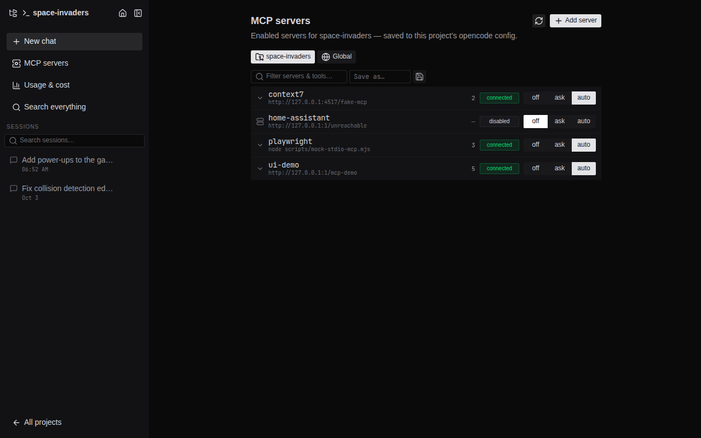
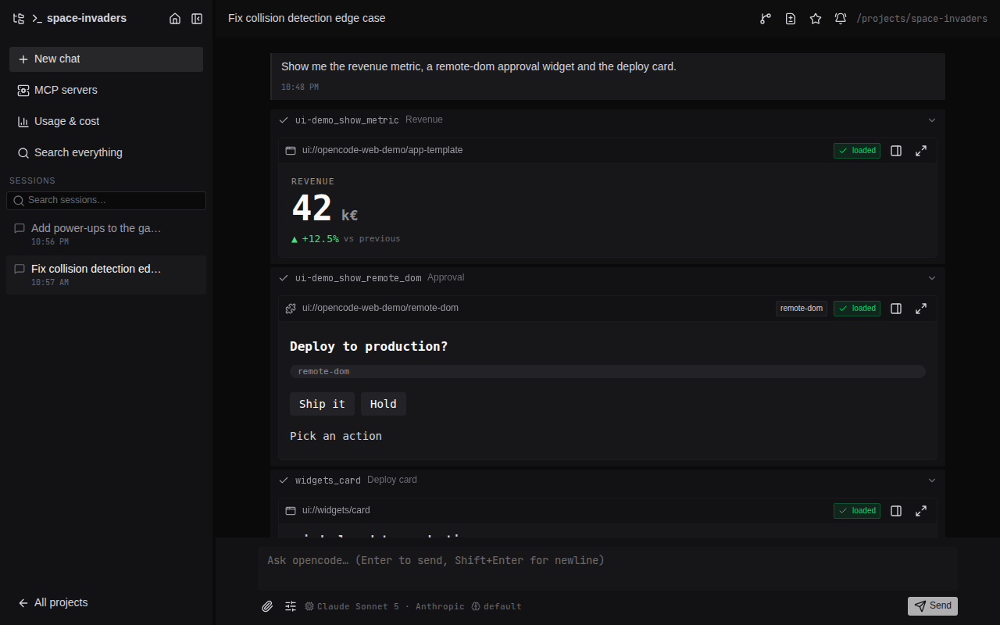

# MCP servers & MCP UI apps

opencode web manages the [MCP](https://modelcontextprotocol.io) servers of the opencode server it fronts, shows which tools each one exposes, and renders the interactive UIs that MCP tools return.



## Where servers are configured

MCP servers live in opencode's own config, so the agent, the TUI and this UI all see the same list:

| scope | file (in the opencode container) | edited from |
| --- | --- | --- |
| global | `/home/node/.config/opencode/opencode.json` (the `opencode-config` volume) | MCP page → **Global** scope |
| project | `<project>/opencode.json` | MCP page → **Project** scope |

Adding a server from the MCP page registers it with the running opencode (`POST /mcp`) **and** persists it with a partial `PATCH` of the config, so it survives restarts. opencode reads its config at startup: after editing `opencode.json` by hand, restart the container (`docker compose restart opencode`).

### Remote servers (Streamable HTTP or legacy SSE)

```jsonc
{
  "mcp": {
    "context7": { "type": "remote", "url": "https://mcp.context7.com/mcp" },
    // legacy HTTP+SSE servers work too: point at the SSE endpoint
    "imdb": { "type": "remote", "url": "http://192.168.1.10:8095/sse" },
    // auth headers are sent on every request
    "internal": {
      "type": "remote",
      "url": "https://tools.example.com/api/mcp",
      "headers": { "Authorization": "Bearer <token>" }
    }
  }
}
```

opencode connects with Streamable HTTP and falls back to SSE. The UI's own client does the same (any 4xx except 401/403 triggers the fallback, `/sse` URLs try SSE first) and accepts both LF and CRLF framed event streams, which Python servers send.

### Local servers (stdio)

```jsonc
{
  "mcp": {
    "n8n": {
      "type": "local",
      "command": ["npx", "-y", "@leonardsellem/n8n-mcp-server"],
      // opencode's key is `environment` (not `env`): other keys are ignored
      "environment": { "N8N_API_URL": "https://n8n.example.com/api/v1", "N8N_API_KEY": "<key>" },
      // first start downloads the package: allow more than the 5s default
      "timeout": 60000
    },
    "fetch": { "type": "local", "command": ["uvx", "mcp-server-fetch"] }
  }
}
```

The opencode server image ships `node`/`npx`, `python3` and `uv`/`uvx`. The `opencode-npm` and `opencode-cache` volumes keep downloaded packages across updates.

> Anything installed into the opencode container outside its volumes (for example a plugin unpacked into `~/.local/share/<name>`) disappears when the image is updated. Keep such files in a volume or bind mount.

### The built-in demo server

`/mcp-demo` on the web app is a small MCP server whose tools return every UI flavour below. Add it from the MCP page (**MCP-UI demo** in the catalog) or by hand:

```json
{ "mcp": { "mcp-ui-demo": { "type": "remote", "url": "http://web:3000/mcp-demo" } } }
```

The URL must be reachable **from the opencode container**. In the bundled compose file that is `http://web:3000/mcp-demo`, which the MCP page uses automatically through `NUXT_PUBLIC_DEMO_MCP_URL`. The web app itself always calls its own demo server over the loopback address of the socket the request arrived on, so it also works behind a reverse proxy with forward auth.

## Tool discovery

opencode's API exposes MCP connection status but no MCP tool ids. The MCP page and the prompt box's per-conversation MCP picker need tool names, so the web app asks each server itself:

- **remote** servers are contacted directly (`initialize` → `tools/list`)
- **local** servers are spawned by the web app and spoken to over stdio, then killed (the whole process group). Results are exact when opencode runs on the same host, approximate otherwise. Set `NUXT_MCP_LOCAL_DISCOVERY` to `same-host` or `never` to change that. Spawned servers get a minimal environment (`PATH`, `HOME`, proxy and locale variables plus the entry's own `environment`), never the web app's secrets.

Results are cached for five minutes with stale-while-revalidate. The refresh button on the MCP page re-probes and updates the cache for every page.

## MCP UI apps

Tools can return interactive UIs. Each one renders live in a sandboxed iframe right in the chat, and can move to a side panel or fullscreen (shareable `?app=…&view=full` links).



| flavour | how it is recognized | sandbox |
| --- | --- | --- |
| **MCP Apps** (SEP-1865) | tool declares `_meta.ui.resourceUri` (`ui://…` template) | `allow-scripts allow-forms`, host speaks JSON-RPC over `postMessage` (`ui/initialize`, `tool-input`, `tool-result`, size, display mode, open-link) |
| mcp-ui **raw HTML** | embedded resource `text/html` | `allow-scripts allow-forms` |
| mcp-ui **external URL** | embedded resource `text/uri-list` | `allow-scripts allow-same-origin allow-forms allow-popups`, **http(s) on another origin only** |
| mcp-ui **remote-dom** | `application/vnd.mcp-ui.remote-dom…` | generic web-component host shell, `allow-scripts allow-forms` |

### Why tools are sometimes run again — and when they aren't

opencode keeps only the text content of an MCP tool result: embedded `ui://` resources and `structuredContent` are dropped before they reach the UI. To show the app anyway, the web app recovers it from the MCP server:

1. **Read-only tools** (`annotations.readOnlyHint: true`) are re-run automatically. They declare that a second run has no side effects.
2. **MCP Apps tools** that are not read-only only get their template read (`resources/read`). Nothing is executed; the app receives the original text output.
3. **Anything else that looks like a UI tool** shows a **Render UI (runs the tool again)** button instead of re-running it silently.

Results are cached for five minutes, so reloading a session doesn't repeat calls. If you write MCP servers with UIs, mark pure tools with `readOnlyHint` so they render without a click.

### Security of rendered apps

- HTML apps never get `allow-same-origin`: they cannot read the web app's cookies or call its API.
- External apps must be `http:`/`https:` URLs on **another** origin. `javascript:`, `data:` and same-origin URLs are refused, because with `allow-same-origin` they would run with full access to the opencode API.
- `ui/open-link` requests from apps are limited to http(s) links.
- Resources are only scanned in MCP tool results: text that looks like a `ui://` resource inside a `bash`, `read` or `webfetch` output never renders.
